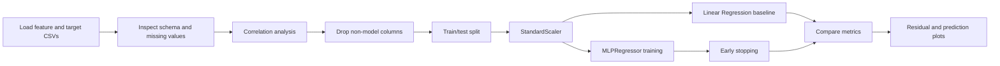

# Smartphone Battery Health Prediction - MLP Network

<p align="center">
  <strong>Deep Learning · Regression · scikit-learn MLPRegressor</strong>
</p>

<p align="center">
  A Multi-Layer Perceptron regressor with early stopping that predicts
  <code>current_battery_health_percent</code> from 12 smartphone usage features.
</p>

<p align="center">
  <a href="https://mlp-vercel.vercel.app">
    
  </a>
</p>

<p align="center">
  
  
  
  
  
  
</p>

## Table of Contents

1. [Tech Stack](#tech-stack)
2. [ML Pipeline Overview](#ml-pipeline-overview)
3. [Dataset Description](#dataset-description)
4. [Preprocessing and Feature Dropping](#preprocessing-and-feature-dropping)
5. [Correlation Analysis](#correlation-analysis)
6. [MLP Architecture](#mlp-architecture)
7. [Early Stopping](#early-stopping)
8. [Hyperparameters](#hyperparameters)
9. [Results and Comparison](#results-and-comparison)
10. [Evaluation Plots](#evaluation-plots)
11. [How to Run](#how-to-run)
12. [License](#license)

## Tech Stack

This project uses `scikit-learn`'s `MLPRegressor` rather than PyTorch or TensorFlow.

| Tool | Role |
| --- | --- |
| Python 3 | Core runtime |
| Pandas | Data loading and tabular handling |
| NumPy | Numerical operations |
| scikit-learn | `MLPRegressor`, scaling, splitting, metrics |
| Matplotlib | Evaluation plots |
| Seaborn | Correlation heatmap and statistical visuals |

## ML Pipeline Overview



## Dataset Description

The project uses two CSV files connected by `Device_ID`.

### Features File

File: `data/smartphone_battery_features.csv`

Shape: `5000 x 15`

| Column | Type | Description |
| --- | --- | --- |
| `Device_ID` | object | Unique device identifier |
| `device_age_months` | int | Age of phone in months |
| `battery_capacity_mah` | int | Battery size in mAh |
| `avg_screen_on_hours_per_day` | float | Average daily screen-on time |
| `avg_charging_cycles_per_week` | float | Weekly charge cycles |
| `avg_battery_temp_celsius` | float | Average battery temperature |
| `fast_charging_usage_percent` | float | Share of fast-charging use |
| `overnight_charging_freq_per_week` | int | Weekly overnight charging frequency |
| `gaming_hours_per_week` | float | Weekly gaming time |
| `video_streaming_hours_per_week` | float | Weekly video streaming time |
| `background_app_usage_level` | object | `Low`, `Medium`, `High` |
| `signal_strength_avg` | object | `Poor`, `Moderate`, `Good` |
| `charging_habit_score` | int | Composite charging-health score |
| `usage_intensity_score` | float | Composite usage intensity score |
| `thermal_stress_index` | float | Composite thermal-stress measure |

### Target File

File: `data/smartphone_battery_targets.csv`

Shape: `5000 x 3`

| Column | Type | Description |
| --- | --- | --- |
| `Device_ID` | object | Device identifier |
| `current_battery_health_percent` | float | Regression target |
| `recommended_action` | object | Human-readable action label |

### Dataset Notes

- Total samples: `5000`
- Final model features used: `12`
- No missing values are reported
- Target predicted: `current_battery_health_percent`

## Preprocessing and Feature Dropping

### Final Modeling Pipeline

1. Load `X_df` and `y_df`
2. Select `current_battery_health_percent` as target
3. Inspect categorical columns for ordinal meaning
4. Use correlation analysis to understand feature relevance and multicollinearity
5. Build final model input from numeric columns
6. Split into train and test sets
7. Standardize features with `StandardScaler`

### Columns Dropped and Why

| Column | Dropped | Why |
| --- | --- | --- |
| `Device_ID` | Yes | Unique identifier, not predictive |
| `recommended_action` | Yes | Not part of regression target |
| `background_app_usage_level` | Yes for final model | Remains object dtype in final numeric-only training matrix |
| `signal_strength_avg` | Yes for final model | Remains object dtype in final numeric-only training matrix |

### Important Implementation Detail

The notebook does correlation analysis on an encoded copy of the dataset, but the final MLP training matrix is created from the original numeric-only dataframe. That means:

- `background_app_usage_level` and `signal_strength_avg` are analyzed
- they are not used in the final trained MLP

### Final Feature Set Used by the MLP

1. `device_age_months`
2. `battery_capacity_mah`
3. `avg_screen_on_hours_per_day`
4. `avg_charging_cycles_per_week`
5. `avg_battery_temp_celsius`
6. `fast_charging_usage_percent`
7. `overnight_charging_freq_per_week`
8. `gaming_hours_per_week`
9. `video_streaming_hours_per_week`
10. `charging_habit_score`
11. `usage_intensity_score`
12. `thermal_stress_index`

## Correlation Analysis

### Correlation with Target

The HTML README presents the same target-correlation story as the notebook: device age is the strongest predictor, followed by charging behavior and thermal stress related features.

| Feature | Correlation with `current_battery_health_percent` |
| --- | ---: |
| `device_age_months` | -0.8541 |
| `avg_charging_cycles_per_week` | -0.4100 |
| `avg_screen_on_hours_per_day` | -0.3993 |
| `avg_battery_temp_celsius` | -0.3008 |
| `thermal_stress_index` | -0.2802 |
| `charging_habit_score` | 0.1379 |

### Multicollinearity Pairs Highlighted

| Feature 1 | Feature 2 | Correlation | Interpretation |
| --- | --- | ---: | --- |
| `avg_screen_on_hours_per_day` | `avg_charging_cycles_per_week` | 0.945 | Heavy usage drives charging frequency |
| `avg_battery_temp_celsius` | `thermal_stress_index` | 0.952 | Thermal stress is strongly tied to heat |

### Practical Note

These highly correlated features are identified, but the model still trains with them present. The MLP learns directly from the full standardized numeric feature set.

## MLP Architecture

The model is a feed-forward neural network built with `MLPRegressor`.

### Architecture Summary


### Layer-by-Layer Details

| Layer | Size | Activation | Role |
| --- | ---: | --- | --- |
| Input | 12 | None | Standardized numeric features |
| Hidden 1 | 32 | ReLU | First nonlinear feature extraction stage |
| Hidden 2 | 16 | ReLU | Compressed learned representation |
| Output | 1 | Linear | Final regression prediction |

### Trainable Parameter Count

| Connection | Parameters |
| --- | ---: |
| `12 x 32 + 32` | 416 |
| `32 x 16 + 16` | 528 |
| `16 x 1 + 1` | 17 |
| Total | 961 |

### Forward Pass

```python
# Layer 1: Input -> Hidden 1
h1 = relu(X_scaled @ W1 + b1)   # shape: (N, 32)

# Layer 2: Hidden 1 -> Hidden 2
h2 = relu(h1 @ W2 + b2)         # shape: (N, 16)

# Output: Hidden 2 -> Prediction
y_hat = h2 @ W3 + b3            # shape: (N, 1)
```

### Activation Function

The network uses `ReLU` in both hidden layers:

```text
f(x) = max(0, x)
```

Why ReLU:

- fast and simple
- works well in shallow neural networks
- reduces vanishing-gradient issues compared with sigmoid or tanh

### Loss and Optimizer

- Loss: Mean Squared Error
- Optimizer: Adam
- Output activation: linear, because this is regression

```text
MSE = (1/N) * sum((y_i - y_hat_i)^2)
```

## Early Stopping

The model uses early stopping to avoid overfitting and stop training automatically when validation performance stops improving.

### Early Stopping Behavior

- Maximum epochs allowed: `500`
- Actual epochs trained: `325`
- Training loss trend reported in the HTML: `2083.3 -> 4.77`
- Stop condition: no improvement for `20` consecutive epochs

### Configuration

| Parameter | Value | Meaning |
| --- | ---: | --- |
| `early_stopping` | `True` | Enables internal validation monitoring |
| `validation_fraction` | `0.1` | Uses 10% of training data for validation |
| `n_iter_no_change` | `20` | Patience before stopping |
| `max_iter` | `500` | Upper epoch bound |

### Validation Split Detail

With an 80/20 train-test split:

- Training set before validation holdout: `4000`
- Internal validation subset: `400`
- Effective fitting subset during each epoch: `3600`

## Hyperparameters

The HTML README states these are the final hand-tuned settings used in the notebook.

| Hyperparameter | Value |
| --- | --- |
| `hidden_layer_sizes` | `(32, 16)` |
| `activation` | `relu` |
| `solver` | `adam` |
| `alpha` | `0.001` |
| `max_iter` | `500` |
| `random_state` | `42` |
| `early_stopping` | `True` |
| `validation_fraction` | `0.1` |
| `n_iter_no_change` | `20` |

```python
mlp = MLPRegressor(
    hidden_layer_sizes=(32, 16),
    activation="relu",
    solver="adam",
    alpha=0.001,
    max_iter=500,
    random_state=42,
    early_stopping=True,
    validation_fraction=0.1,
    n_iter_no_change=20
)
```

## Results and Comparison

### Final MLP Results

| Metric | Value |
| --- | ---: |
| R2 | 0.9620 |
| RMSE | 3.4514 |
| MAE | 2.7117 |
| Epochs trained | 325 |

### Baseline Comparison

| Model | R2 | RMSE | MAE | Training |
| --- | ---: | ---: | ---: | --- |
| Linear Regression | 0.9299 | 4.6847 | 3.6770 | Single pass |
| MLP Network | 0.9620 | 3.4514 | 2.7117 | 325 epochs with Adam |

### Improvement Over Baseline

| Metric | Change |
| --- | --- |
| R2 | `+0.0321` |
| RMSE | `-1.2333` |
| MAE | `-0.9653` |

### Full Three-Model Summary

| Model | R2 | RMSE | MAE | Key idea |
| --- | ---: | ---: | ---: | --- |
| Linear Regression | 0.9299 | 4.6847 | 3.6770 | Baseline, no nonlinearity |
| RBF Network | 0.9419 | 4.2668 | 3.2549 | 1500 K-Means centers plus Ridge |
| MLP Network | 0.9620 | 3.4514 | 2.7117 | `32 -> 16` ReLU network with Adam and early stopping |

## Evaluation Plots

The HTML README describes six visual diagnostics generated by the notebook.

| Plot | Purpose |
| --- | --- |
| Predicted vs Actual | Checks whether predictions cluster around the diagonal |
| Residual Plot | Reveals bias or heteroscedasticity |
| Residual Distribution | Shows whether residuals are centered near zero |
| Absolute Error Distribution | Highlights the spread of prediction error |
| Training Loss Curve | Shows optimization progress and early stopping behavior |
| Smoothed Expected vs Predicted | Shows tracking quality over sorted test samples |

## How to Run

```bash
# 1. Install dependencies
pip install pandas numpy matplotlib seaborn scikit-learn

# 2. Open and run the notebook
jupyter notebook MLP_Model.ipynb
```

### Expected Output

```text
Linear Regression RMSE: 4.6847
Linear Regression R2:   0.9299

MLP RMSE: 3.4514
MLP MAE:  2.7117
MLP R2:   0.9620
```


### Dataset Path Note

If the notebook expects CSVs in the notebook directory but your files are under `data/`, update the paths accordingly before running.

## License

This project is licensed under the **MIT License**.

See the [LICENSE](/d:/sanket/CNN/MLP/LICENSE) file for the full license text.
